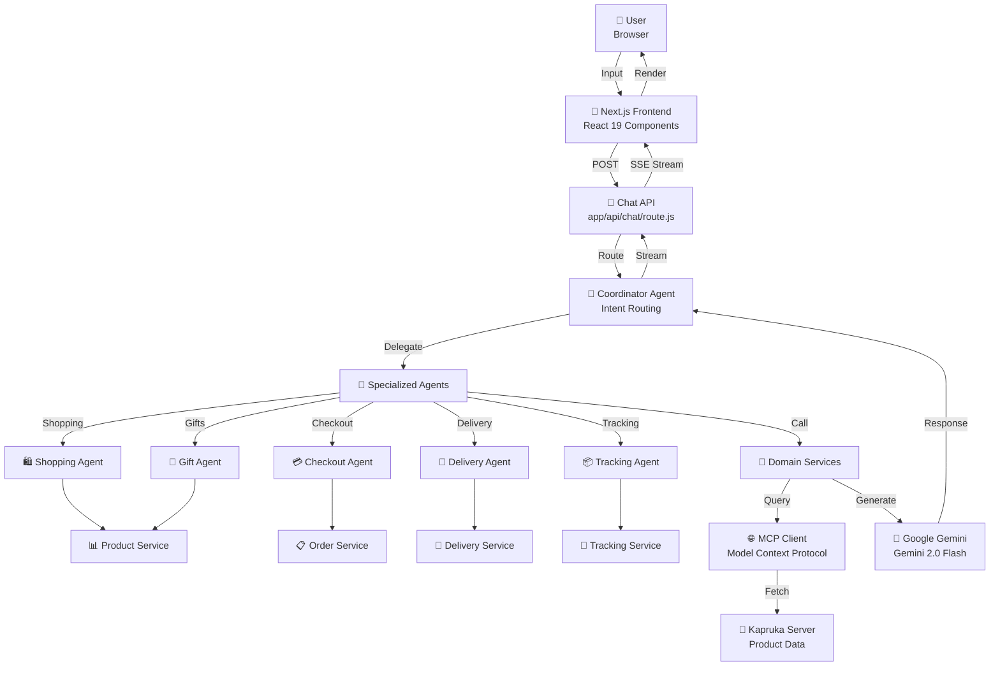

# 🛍️ Kapruka Genie

> **Your AI-Native Shopping Assistant for Sri Lanka**  
> Powered by Google Gemini AI, real-time product data via the Model Context Protocol (MCP), and seamless Kapruka e-commerce integration.

[](https://nextjs.org/)
[](https://react.dev/)
[](https://nodejs.org/)
[](https://aistudio.google.com/)

---

## 📖 Table of Contents

- [Overview](#overview)
- [Key Features](#key-features)
- [System Architecture](#system-architecture)
- [Getting Started](#getting-started)
- [Project Structure](#project-structure)
- [Agents & Orchestration](#agents--orchestration)
- [Configuration](#configuration)
- [Development Guide](#development-guide)
- [Deployment](#deployment)

---

## 📝 Overview

**Kapruka Genie** is an intelligent conversational shopping assistant that transforms how customers interact with the Kapruka e-commerce platform. Built on modern web technologies and powered by Google's Gemini AI, it orchestrates a fleet of specialized AI agents to provide a seamless, natural, and highly personalized shopping experience.

Whether searching for gifts, checking delivery availability to a specific Sri Lankan city, placing orders, or tracking shipments—Kapruka Genie handles it all through an intuitive, human-like chat interface, making shopping as easy as messaging a friend.

### 🎯 What Makes It Special?

- **Multi-Agent Architecture**: Five specialized AI agents working together in harmony under a central coordinator.
- **Conversational UX**: Natural language interaction instead of traditional clicks and scrolling.
- **Real-time Intelligence**: Live product data, delivery costs, and order tracking via Kapruka's MCP server.
- **Sri Lankan Focus**: Deeply optimized for local culture, delivery zones, and languages (English, Sinhala, Tamil, Tanglish).
- **Enterprise-Ready**: Equipped with rate limiting, error boundaries, streamable SSE APIs, and caching.

---

## ✨ Key Features

| Feature | Description | Agent |
|---------|-------------|-------|
| 🔍 **Smart Product Search** | AI-powered discovery across Kapruka's vast catalog of 125,000+ items. | Shopping Agent |
| 🎁 **Gift Recommendations** | Culturally-aware, occasion-based gift suggestions tailored to your budget. | Gift Agent |
| 🚚 **Delivery Intelligence** | Real-time delivery availability, city lookups, and shipping cost calculations. | Delivery Agent |
| 💳 **One-Click Checkout** | Streamlined guest checkout flow with a 60-minute price lock and instant payment links. | Checkout Agent |
| 📦 **Live Order Tracking** | Real-time order status and visual delivery timeline updates. | Tracking Agent |
| 🌐 **Multi-Language Support** | Auto-detects and responds in English, Sinhala, Tamil, or Tanglish. | Core / i18n |
| ⚡ **Resilient Infrastructure** | Built-in caching, request deduplication, and exponential backoff retries. | Core / MCP |

---

## 🏗️ System Architecture

### High-Level Flow Diagram



---

## 🚀 Getting Started

### Prerequisites

Before you begin, ensure you have installed:
- **Node.js** 18.x or higher
- **npm** 9.x or higher
- A Google Gemini API key (get one for free at [Google AI Studio](https://aistudio.google.com))

### Installation & Setup

1. **Clone the repository**
   ```bash
   git clone https://github.com/yourusername/kapruka-genie.git
   cd kapruka-genie
   ```

2. **Install dependencies**
   ```bash
   npm install
   ```

3. **Configure environment variables**  
   Create a `.env.local` file in the root directory:
   ```bash
   # Required: Google Gemini API key for the LLM agents
   GEMINI_API_KEY=your_gemini_api_key_here
   
   # Optional: Custom MCP endpoint (defaults to Kapruka production)
   MCP_ENDPOINT=https://mcp.kapruka.com/mcp
   ```

4. **Start the development server**
   ```bash
   npm run dev
   ```

5. **Open in browser**  
   Navigate to [http://localhost:3000](http://localhost:3000) and start chatting with Kapruka Genie!

---

## 📁 Project Structure

```
kapruka-genie/
├── app/                    # Next.js App Router
│   ├── api/                # API routes
│   │   ├── chat/route.js   # Main streaming chat endpoint
│   │   └── mcp/route.js    # MCP proxy endpoint for external testing
│   ├── chat/               # The chat application page
│   ├── layout.js           # Root layout with ErrorBoundary
│   ├── globals.css         # Global design system variables
│   └── page.js             # Beautiful animated landing page
│
├── components/             # Reusable React Components
│   ├── ProductCard.js      # Interactive product display
│   ├── OrderSummary.js     # Checkout confirmation modal
│   ├── TrackingCard.js     # Order status timeline
│   ├── ErrorBoundary.js    # Graceful error handling
│   └── LoadingScreen.js    # Cinematic loading state
│
└── lib/                    # Core Business Logic & Infrastructure
    ├── agents/             # AI Agents (Coordinator + 5 sub-agents)
    ├── i18n/               # Multilingual dictionaries (EN, SI, TA, Tanglish)
    ├── mcp/                # Separated transport, cache, and client layers
    ├── services/           # Domain-specific logic wrapping MCP calls
    ├── gemini.js           # Gemini 2.0 Flash configuration
    ├── rate-limiter.js     # Token-bucket limiters (Chat, MCP, Orders)
    └── session.js          # Context schema validation
```

---

## 🤖 Agents & Orchestration

Kapruka Genie leverages a **multi-agent architecture** where each agent specializes in one specific domain of the shopping journey.

### 🎯 Coordinator Agent (`lib/agents/coordinator.js`)
The "brain" of the system. It analyzes the user's natural language input, determines the core intent, and routes the request to the most capable specialist agent, maintaining context across multi-turn conversations.

### 🛍️ Shopping Agent (`lib/agents/shopping-agent.js`)
Handles all product discovery tasks. It searches the Kapruka catalog, fetches detailed product insights, and helps users find exactly what they're looking for based on price, category, and availability.

### 🎁 Gift Agent (`lib/agents/gift-agent.js`)
A culturally-aware gifting specialist. It asks gentle, conversational questions about the recipient and occasion, and then recommends the perfect Sri Lankan gift (from cakes to electronics) that fits the user's budget.

### 🚚 Delivery Agent (`lib/agents/delivery-agent.js`)
The logistics expert. It verifies delivery availability for specific cities across Sri Lanka, estimates delivery timelines, and proactively flags restrictions on perishable items like fresh flowers or food.

### 💳 Checkout Agent (`lib/agents/checkout-agent.js`)
A secure, multi-step order assistant. It collects necessary details (address, recipient, phone number), securely places the order, and provides a direct payment link while enforcing a strict 60-minute price lock warning.

### 📦 Tracking Agent (`lib/agents/tracking-agent.js`)
The post-purchase guide. Give it an order number, and it will fetch the real-time status of the package, complete with a visual delivery timeline.

---

## ⚙️ Configuration

### Rate Limiting Defaults
The application is equipped with robust Token Bucket rate limiters to ensure platform stability and prevent abuse:
- **Chat Requests**: 60 requests per minute
- **General MCP Lookups**: 60 requests per minute
- **Order Creations**: 30 orders per hour (strictly enforced)

### Intelligent Caching
To minimize latency and reduce unnecessary external network calls, read-only data (like categories and product details) is cached in-memory with a **30-minute Time-To-Live (TTL)**. Write operations (like order creation) bypass the cache entirely.

---

## 📚 Development Guide

### Adding a New Language Translation
Kapruka Genie auto-detects language using script heuristics. To add a new language or tweak existing phrases:
1. Navigate to `lib/i18n/`.
2. Edit the respective dictionary file (e.g., `si.js` for Sinhala).
3. Update the `detectLanguage` heuristic in `index.js` if you are adding an entirely new script.

### Using the Direct MCP Proxy
For debugging Kapruka's MCP endpoints directly without invoking the AI, you can make POST requests to `/api/mcp`:
```bash
curl -X POST http://localhost:3000/api/mcp \
  -H "Content-Type: application/json" \
  -d '{"tool": "kapruka_list_categories", "params": {}}'
```

---

## 🚀 Deployment

### Vercel (Recommended)

1. Push your repository to GitHub.
2. Import the project into your Vercel dashboard.
3. Configure your Environment Variables (`GEMINI_API_KEY`).
4. Deploy! The Next.js App Router will automatically build and optimize the site.

---

## 🤝 Contributing
Contributions are always welcome! Feel free to open an issue or submit a pull request if you have ideas for new features, design enhancements, or bug fixes.

---

Built with ❤️ for Sri Lanka using cutting-edge Generative AI and modern web technologies.
